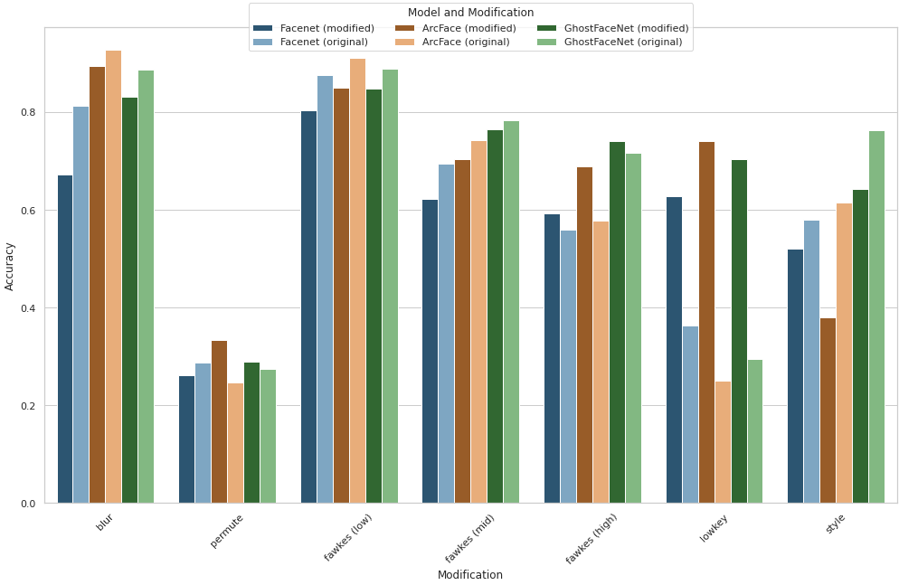

# Privacy preserving facial recognition

This project was conducted as part of my master's thesis ["Privacy preservation aspects of image modification in facial recognition"](./thesis.pdf) at the Wrocław University of Science and Technology.

## Problem Statement
The goal was to develop a facial recognition system that does not rely on original face embeddings. Instead, we propose modifying the images before feature extraction and retaining their vector representations. The ideal modification should enable the system to perform effectively with similarly modified images while failing to recognize original, unmodified images. In the event of data leakage, embeddings from such a system would provide significantly less information about the users compared to original embeddings. Developing such a system represents a crucial step towards creating better privacy-preserving facial recognition technologies.

## Results
The detailed results can be found in the file [thesis](./thesis.pdf). In short, we demonstrate that it is possible to use the [LowKey](https://arxiv.org/pdf/2101.07922) modification to create a system with a modified image database that performs well against images with the same modification (74\% accuracy) but significantly worse with unmodified images (25\% accuracy). We believe this approach can serve as a cornerstone for developing even better techniques focusing primarily on our goal.
Additionally, we performed a sensitivity analysis on our dataset and concluded that the tested modifications introduce some disturbance in the embedding space, warranting further examination. 
By integrating these findings, our work lays the groundwork for advancing the development of facial recognition systems that prioritize privacy.


## Directory Structure

- `datasets/`: Directory for the chosen image dataset (e.g. FaceScrub). The extracted subsets will also be placed here.
- `embeddings/`: Directory for embeddings generated by `create_embeddings.py`.
- `fawkes/`: Directory for original implementation of "Fawkes: Protecting Privacy against Unauthorized Deep Learning Models" (https://github.com/Shawn-Shan/fawkes).
- `lowkey/`: Directory for original implementation of "LowKey: Leveraging Adversarial Attacks to Protect Social Media Users from Facial Recognition" (https://openreview.net/forum?id=hJmtwocEqzc).
- `style_transfer/`: Directory for models and images related to the "Image Style Transfer Using Convolutional Neural Networks".
- `models_weights/`: Directory for pre-trained model weights for FaceNet, ArcFace and GhostFaceNet.
- `utils/`: Contains utility scripts for the project.

## Scripts

- `preprocess_dataset.py`: Script to preprocess the dataset into subsets.
- `modify_images.py`: Script to create modified subsets.
- `create_embeddings.py`: Script to create embeddings from the subsets.
- `evaluate_embeddings.py`: Script to evaluate embeddings.
- `evaluate_dprivacy.py`: Script to evaluate differential privacy.
- `evaluate_sensitivity.py`: Script to evaluate sensitivity.
- `analyze.ipynb`: Jupyter Notebook for analyzing results.

## Installation

To install the required packages, run:
```bash
pip install -r requirements.txt
```
